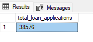
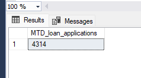
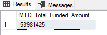
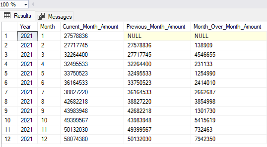
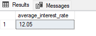
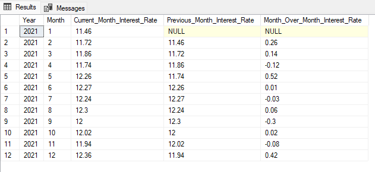

# Bank_Loan_Project
Finance Domain | Bank Loan Analysis

# KPI
### <span style="color:red"> 1. Total Loan Applications </span>

```sql 
select count(id) as total_loan_applications from bank_loan_data;
```
#### Output:{style="color:navy"}



### 2. Month to Date Loan Applications{style="color:red"}

```sql
SELECT count(id) as MTD_loan_applications from bank_loan_data
WHERE MONTH(issue_date) = 12 AND YEAR(issue_date) = 2021;
```
or
```sql
# to make it dynamic rather than getting static month and date
SELECT COUNT(id) AS MTD_loan_applications 
FROM bank_loan_data 
WHERE YEAR(issue_date) = YEAR(GETDATE()) 
AND MONTH(issue_date) = MONTH(GETDATE());
```
#### Output:{style="color:navy"}


### 3. Month to Date Total Funded Amount{style="color:red"}

```sql
SELECT SUM(loan_amount) as MTD_Total_Funded_Amount from bank_loan_data
WHERE MONTH(issue_date) = 12 AND YEAR(issue_date) = 2021;
```

#### Output:{style="color:navy"}


### 4. Month over Month Total Funded Amount{style="color:red"}
```sql

WITH MonthlyTotals AS (
    SELECT 
        YEAR(issue_date) AS Year,
        MONTH(issue_date) AS Month,
        SUM(total_payment) AS Monthly_Total_Amount_Received
    FROM 
        bank_loan_data
    WHERE 
        YEAR(issue_date) = 2021 -- Filter by the desired year
    GROUP BY 
        YEAR(issue_date),
        MONTH(issue_date)
),
MonthOverMonth AS (
    SELECT 
        t1.Year,
        t1.Month,
        t1.Monthly_Total_Amount_Received AS Current_Month_Amount,
        t2.Monthly_Total_Amount_Received AS Previous_Month_Amount,
        t1.Monthly_Total_Amount_Received - t2.Monthly_Total_Amount_Received AS Month_Over_Month_Amount
    FROM 
        MonthlyTotals t1
    LEFT JOIN 
        MonthlyTotals t2 ON t1.Year = t2.Year AND t1.Month = t2.Month + 1
)
SELECT 
    Year,
    Month,
    Current_Month_Amount,
    Previous_Month_Amount,
    Month_Over_Month_Amount
FROM 
    MonthOverMonth
ORDER BY 
    Year,
    Month;

```
#### Output:{style="color:navy"}


### 5. Average Interest Rate for year 2021{style="color:red"}
```sql
SELECT 
	ROUND(AVG(int_rate)*100,2) as average_interest_rate
FROM
	bank_loan_data
WHERE
	YEAR(issue_date) = 2021;
```

#### Output:{style="color:navy"}


### 5. Month over Month Average Interest Rate{style="color:red"}

```sql
WITH MonthlyInterestRate AS(
	SELECT
		YEAR(issue_date) as Year,
		MONTH(issue_date) as Month,
		ROUND(AVG(int_rate)*100,2) as monthly_average_interest_rate
	FROM
		bank_loan_data
	WHERE
		YEAR(issue_date) = 2021
	GROUP BY
		YEAR(issue_date),
		MONTH(issue_date)
), 
MonthOverMonthInterestRate AS(
	SELECT
		MIR1.Year,
		MIR1.Month,
		MIR1.monthly_average_interest_rate as Current_Month_Interest_Rate,
		MIR2.monthly_average_interest_rate as Previous_Month_Interest_Rate,
		ROUND((MIR1.monthly_average_interest_rate - MIR2.monthly_average_interest_rate),2) as Month_Over_Month_Interest_Rate
	FROM
		MonthlyInterestRate MIR1
	LEFT JOIN
		MonthlyInterestRate MIR2
	ON
		MIR1.Year = MIR2.Year
		and MIR1.Month = MIR2.Month+1
)
SELECT
	Year, 
	Month, 
	Current_Month_Interest_Rate, 
	Previous_Month_Interest_Rate, 
	Month_Over_Month_Interest_Rate 
FROM 
	MonthOverMonthInterestRate 
ORDER BY
	Year, 
	Month;

```

#### Output:{style="color:navy"}
